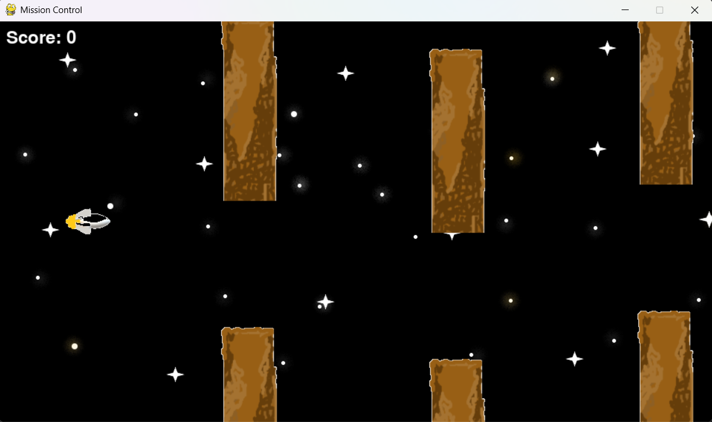

# Mission Control 🚀

A 2D endless runner game built with PyGame where the player navigates a rocket through obstacles.

## 📸 Screenshot

## Features
- Smooth player movement (4-directional)
- Procedurally generated obstacles
- Collision detection system
- Score tracking
- Game over screen

## Technologies
- Python
- PyGame

## How to Run
- pip install pygame
- python main.py